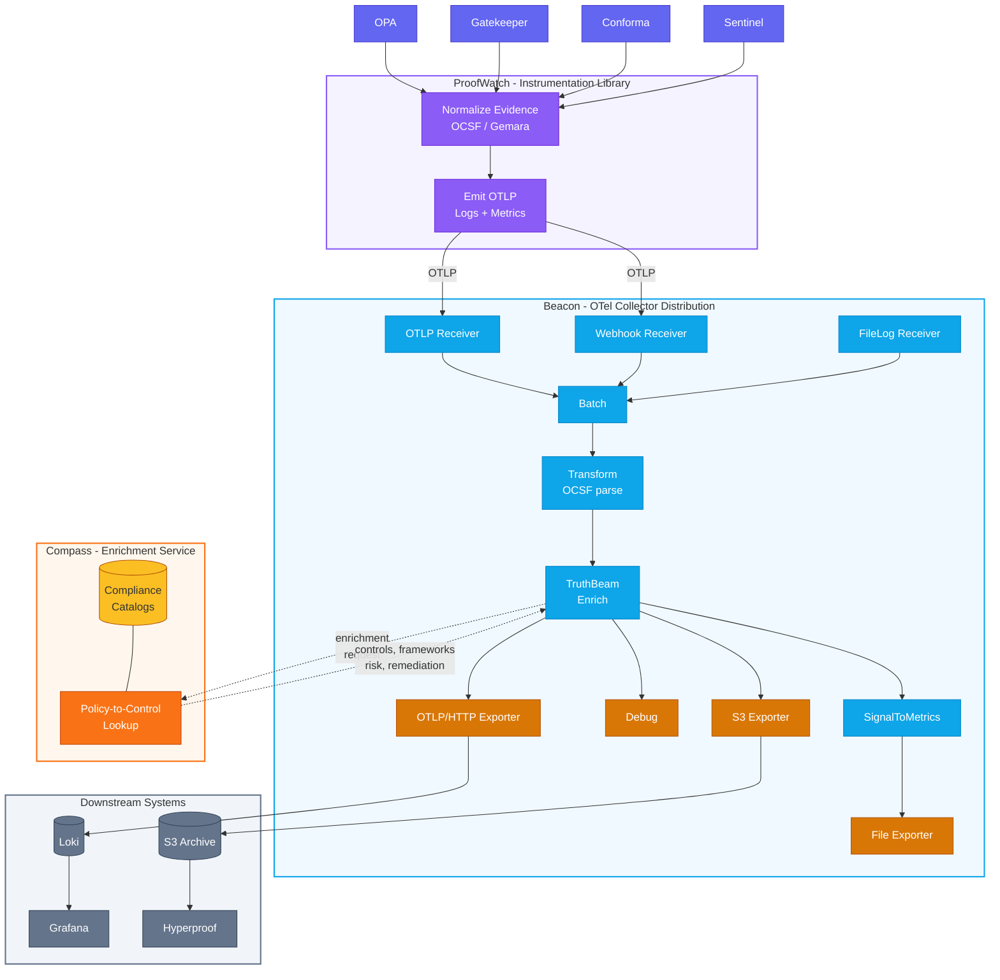

# ComplyBeacon

**ComplyBeacon** is an open-source observability toolkit that collects, normalizes, and enriches compliance evidence by extending the OpenTelemetry (OTel) standard.

It bridges the gap between raw policy scanner output and modern logging pipelines, providing a unified, enriched, and auditable data stream for security and compliance analysis.

---

> **WARNING:** All components are under initial development and are **not** ready for production use.

---

## Architecture

ComplyBeacon is composed of four components that form an evidence enrichment pipeline:

### 1. ProofWatch

An instrumentation library that accepts raw compliance evidence from policy scanners (OPA, Gatekeeper, Conforma, Sentinel), normalizes it into OCSF/Gemara format, and emits it as an OpenTelemetry log stream with accompanying metrics.

### 2. Beacon

A custom OpenTelemetry Collector distribution that hosts the pipeline. It receives log records via OTLP, webhook, or file input, batches and transforms them, then routes them through enrichment and on to exporters.

### 3. TruthBeam

A custom OpenTelemetry Collector processor that enriches log records by calling the Compass service to attach compliance framework mappings, risk scores, and remediation guidance.

### 4. Compass

A policy-to-control lookup service that maps evidence attributes to compliance frameworks, baselines, and risk data. Compass is an external service that must be provided separately for TruthBeam enrichment to function.

### Data Flow



## Prerequisites

- **Go 1.25+**
- **Task** ([taskfile.dev](https://taskfile.dev/installation/))
- **Podman**
- **Git**

```bash
# Install Task
brew install go-task/tap/go-task  # macOS
# or
go install github.com/go-task/task/v3/cmd/task@latest
```

## Quick Start

### 1. Build and Deploy

The demo stack runs Beacon, Loki, and Grafana via compose:

```bash
# Build the collector image (resolves deps, syncs versions, builds container)
task build

# Start all services
task infra:deploy

# Stop everything
task infra:undeploy
```

### 2. Test the Pipeline

```bash
# Send sample compliance evidence
curl -X POST http://localhost:8088/eventsource/receiver \
  -H "Content-Type: application/json" \
  -d @hack/sampledata/evidence.json

# View enriched logs in Grafana at http://localhost:3000
```

### 3. Evidence Storage (S3)

The demo stack includes [rustfs](https://github.com/rustfs/rustfs), an S3-compatible object store, so evidence archival works out-of-the-box with no configuration.

After `task infra:deploy`, the following are available:

| Service        | URL                       | Credentials                    |
|----------------|---------------------------|--------------------------------|
| rustfs S3 API  | <http://localhost:9000>     | `rustfsadmin` / `rustfsadmin`  |
| rustfs Console | <http://localhost:9001>     | `rustfsadmin` / `rustfsadmin`  |

Evidence files are written to the `complybeacon-evidence` bucket and can be browsed in the rustfs console.

#### Using Real AWS S3 Instead

To export evidence to a real AWS S3 bucket, override the defaults by exporting environment variables before starting the stack:

| Variable               | Default (local dev)        | Description                     |
|------------------------|----------------------------|---------------------------------|
| `AWS_REGION`           | `us-east-1`               | AWS region of your S3 bucket    |
| `S3_BUCKETNAME`        | `complybeacon-evidence`    | Target S3 bucket name           |
| `S3_OBJ_DIR`           | `evidence`                 | Folder prefix for objects       |
| `AWS_ACCESS_KEY_ID`    | `rustfsadmin`              | AWS access key                  |
| `AWS_SECRET_ACCESS_KEY`| `rustfsadmin`              | Corresponding secret key        |
| `S3_ENDPOINT`          | `http://rustfs:9000`       | S3 endpoint (unset for AWS)     |

Production deployments should use a dedicated collector configuration with `disable_ssl: false` and `s3_force_path_style: false`. See [Sync_Evidence2Hyperproof](docs/integration/Sync_Evidence2Hyperproof.md) for the full AWS integration guide.

## Development

### Task Commands

```bash
task                       # List all available tasks
task build                 # Build the collector container image
task test                  # Run tests with coverage
task test-race             # Run tests with race detection
task lint                  # Run golangci-lint
task check                 # Run all quality gates (lint + test)
task deps                  # Tidy, verify, and download dependencies
task workspace             # Set up Go workspace
task clean                 # Remove build artifacts and test output
```

### Code Generation

```bash
task codegen:api-codegen               # Regenerate OpenAPI client (truthbeam)
task codegen:weaver-codegen            # Regenerate attribute constants from model/
task codegen:weaver-docsgen            # Regenerate attribute docs from model/
task codegen:weaver-check              # Validate semantic convention model
task codegen:weaver-semantic-check     # Validate logs against semantic conventions
```

### Version Management

The project prevents version drift between the Go modules and the beacon-distro collector distribution. Version checks run automatically with `task test` and block CI if versions diverge.

```bash
task version:check-otel-versions       # Check alignment
task version:sync-otel-versions        # Sync beacon-distro with truthbeam
task version:check-go-version          # Verify Go version compatibility
task version:check-go-mod-consistency  # Check OTel dependency consistency
```

### Container Image

The beacon collector image is built from `beacon-distro/Containerfile.collector`:

```bash
# Build with default tag (complybeacon/collector:latest)
task build

# Build with custom image name and tag
task build IMAGE=ghcr.io/complytime/complybeacon TAG=v1.0.0

# Run standalone (without compose)
podman run --rm \
  -v ./hack/demo/demo-config.yaml:/etc/otel-collector.yaml:Z \
  -p 4317:4317 -p 8088:8088 \
  complybeacon/collector:latest \
  --config=/etc/otel-collector.yaml
```

**Grafana Dashboard:** To configure Loki as default datasource, see [hack/demo/terraform/README.md](./hack/demo/terraform/README.md).

## Additional Resources

- **Design & Architecture:** [docs/DESIGN.md](./docs/DESIGN.md)
- **Development Guide:** [docs/DEVELOPMENT.md](./docs/DEVELOPMENT.md)
- **Image Publishing:** [docs/publish_image/publish_image.md](./docs/publish_image/publish_image.md)
- **OpenTelemetry:** [opentelemetry.io](https://opentelemetry.io/docs/)
