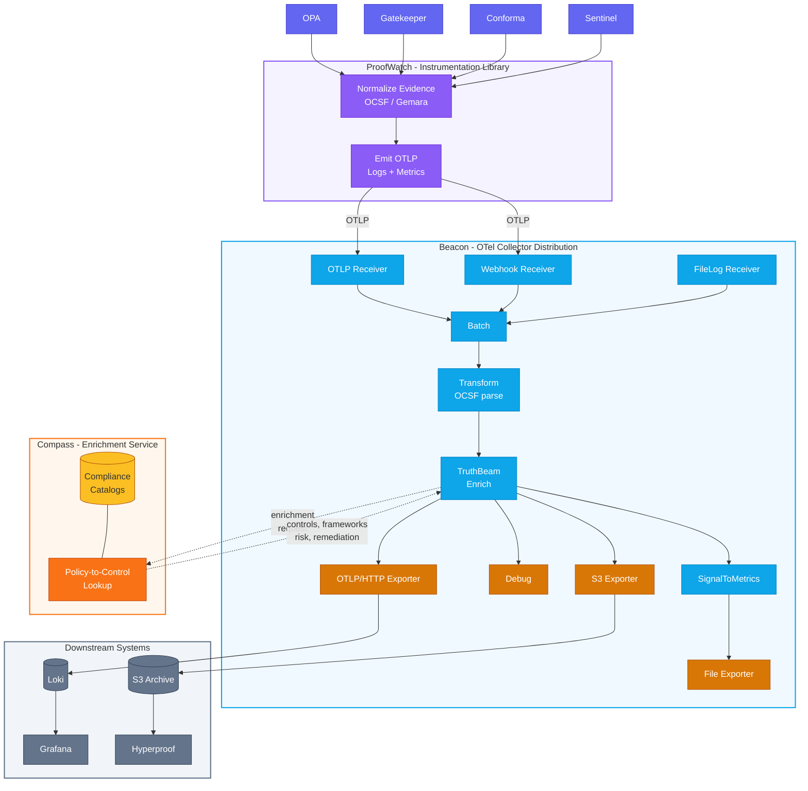

# ComplyBeacon

**ComplyBeacon** is an open-source observability toolkit designed to collect, normalize, and enrich compliance evidence, extending the OpenTelemetry (OTEL) standard.

By bridging the gap between raw policy scanner output and modern logging pipelines, it provides a unified, enriched, and auditable data stream for security and compliance analysis.

---

⚠️ **WARNING:** All components are under initial development and are **not** ready for production use.

---

## The ComplyBeacon Architecture

ComplyBeacon is a policy-driven observability toolkit composed of four main components that work together to process and enrich compliance data.

### 1. ProofWatch

An instrumentation library that accepts and emits pre-normalized compliance evidence as an OpenTelemetry log stream, while also instrumenting metrics for real-time observability.

### 2. Beacon

A custom OpenTelemetry Collector distribution that acts as the pipeline's host, receiving log records from ProofWatch and preparing them for the next stage of enrichment.

### 3. TruthBeam

A custom OpenTelemetry Collector processor that enriches log records with compliance and risk data by integrating with the Compass service.

### 4. Compass

A central enrichment service that provides risk, threat, and compliance framework attributes based on policy lookup data. Compass is maintained as a separate project at [gemara-content-service](https://github.com/complytime/gemara-content-service) and is consumed here as a pre-built container image (`ghcr.io/complytime/gemara-content-service`).

### How It All Fits Together



## Quick Start

Before Deploying: Please read the following **NOTE**.

⚠️ **NOTE:**
To enable evidence log synchronization to AWS S3 and Hyperproof, you must configure the following environment variables. The collector will fail to start if the S3 configuration is invalid.

For more detailed information, please refer to the integration guide: [Sync_Evidence2Hyperproof](docs/integration/Sync_Evidence2Hyperproof.md).

| Environment Variable   | Description                                            |
|------------------------|---------------------------------------------------------|
| `AWS_REGION`           | The AWS region where your S3 bucket is hosted           |
| `S3_BUCKETNAME`        | The name of the target S3 bucket.                       |
| `S3_OBJ_DIR`           | The folder path (prefix) for bucket subjects            |
| `AWS_ACCESS_KEY_ID`    | The AWS Access Key ID with permissions to the bucket    |
| `AWS_SECRET_ACCESS_KEY`| The AWS Secret Access Key corresponding to the ID.      |


If you do not wish to use the AWS S3 integration, you can disable it by modifying the configuration files:

A. **In [hack/demo/demo-config.yaml](hack/demo/demo-config.yaml)** change the exporters line from:

`exporters: [debug, otlphttp/logs, awss3/logs, signaltometrics]`

to

`exporters: [debug, otlphttp/logs, signaltometrics]`

The `awss3/logs` configuration in `exporters` section should also be commented.

```yaml
exporters:
  debug:
    verbosity: detailed
  otlphttp/logs:
    endpoint: "http://loki:3100/otlp"
    tls:
      insecure: true
  # File exporter: writes metrics as JSON for filelog receiver
  file/metrics:
    path: /data/metrics.jsonl
    format: json
  awss3/logs:
    s3uploader:
      region: ${AWS_REGION}
      s3_bucket: ${S3_BUCKETNAME}
      s3_prefix: ${S3_OBJ_DIR}
      s3_partition_format: ""
```

to 

```yaml
exporters:
  debug:
    verbosity: detailed
  otlphttp/logs:
    endpoint: "http://loki:3100/otlp"
    tls:
      insecure: true
  # File exporter: writes metrics as JSON for filelog receiver
  file/metrics:
    path: /data/metrics.jsonl
    format: json
#  awss3/logs:
#    s3uploader:
#      region: ${AWS_REGION}
#      s3_bucket: ${S3_BUCKETNAME}
#      s3_prefix: ${S3_OBJ_DIR}
#      s3_partition_format: ""
```

B. **Comment collector.environment part of [compose.yml](compose.yaml)** as the AWS S3 environment variables will no longer be needed.

Once you've reviewed the **NOTE** above, follow these steps to deploy the infrastructure and test the pipeline.

1. **Deploy the Stack:**
    This command starts the full infrastructure, including Grafana, Loki, the custom collector (`Beacon`), and the `Compass` service (pulled from `ghcr.io/complytime/gemara-content-service` or local build).
    ```bash
    podman-compose up --build
    ```

2. **Test the Pipeline:**
    Send sample compliance data to the webhook receiver to test the pipeline's functionality.
    ```bash
    curl -X POST http://localhost:8088/eventsource/receiver -H "Content-Type: application/json" -d @hack/sampledata/evidence.json
    ```
   
3. **Enable grafana dashboard:**
    If you want to configure loki as default datasource on grafana and enable pre-build grafana dashboard, refer to [README.md](./hack/demo/terraform/README.md)

## Version Maintenance

After Dependabot updates OpenTelemetry Collector dependencies in `truthbeam/go.mod`, sync the beacon-distro manifest:

```bash
make sync-otel-versions
git add beacon-distro/
git commit -m "chore: sync beacon-distro with truthbeam OTel versions"
```

CI will block PRs if versions drift between `truthbeam` and `beacon-distro`.

## Project Design

For additional details on the planned design and roadmap, see [`DESIGN.md`](./docs/DESIGN.md).

## Updating the Semantic Conventions

Update semantic convention under `model/`

Validate with `make weaver-check`

Update docs and code:
`make weaver-docsgen`
`make weaver-codegen`

---
